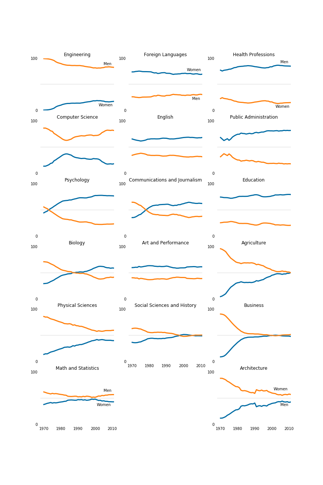

# Visualizing gender gap in college degrees

The dataset used for this analysis contains percentage of college degrees awarded to women by major from 1970 to 2012. Flexing the muscles of matplotlib, I tried to perfect the visualizations comparing the percentages of degrees awarded to men and women across popular majors.

## Files

| File name | Description |
| :--- | :--- |
| [environment.yml](environment.yml) | Conda environment required to run this code |
| [percent-bachelors-degrees-women-usa.csv](percent-bachelors-degrees-women-usa.csv) | csv file with the % degrees granted to woman by major from 1970 to 2012 |
| [percent-bachelors-degrees-women-usa.ipynb](percent-bachelors-degrees-women-usa.ipynb) | Jupyter Notebook with the code and analysis |

## Setup

- You must have [Anaconda](https://www.continuum.io/downloads) installed to run this code.
- Create a conda environment using [environment.yml](environment.yml) YAML file. More help on this can be found [here](https://conda.io/docs/using/envs.html#use-environment-from-file).

## License

The contents of this repository are covered under the [MIT License](LICENSE).
